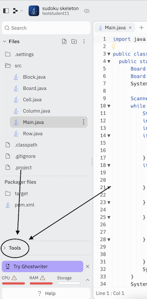
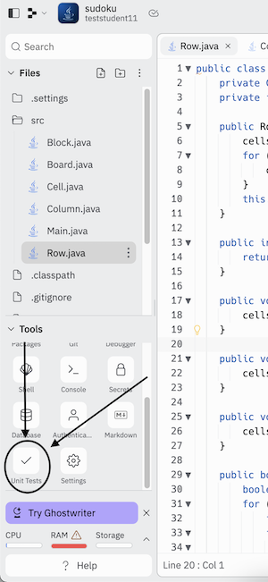
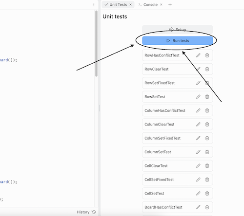
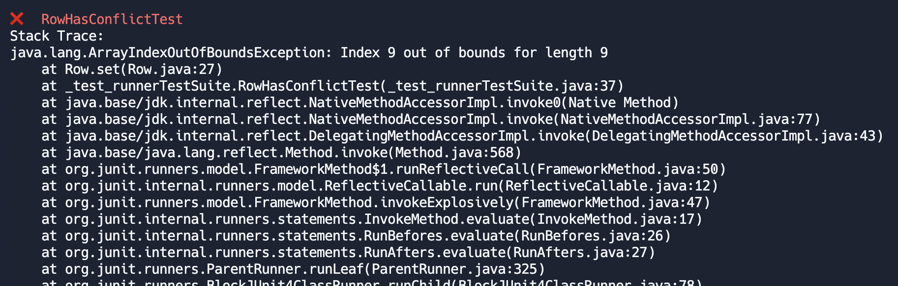
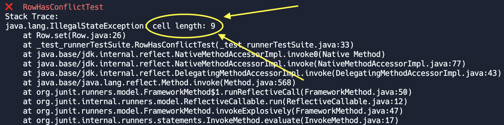
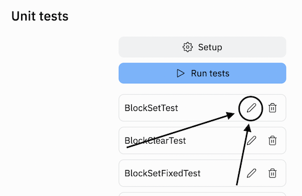

# Sudoku
Welcome to your first programming project! You will use what you've learned in this course to build a fully functioning app worthy of bragging about in your resume / CV :) After you complete the project, you'll be able to interact with the code by setting / clearing / auto-solving the board.

# Prerequisites
Ensure that you have created an account at [replit.com](https://replit.com/) and **that you have verified your email** 

# Overview
Sudoku is a puzzle game in which a 9x9 grid must be filled entirely with numbers 1 through 9. The 9x9 grid is further subdivided into nine 3x3 grids, whose purpose will be described shortly. The puzzle is typically filled with a few values at the start and is subject to the following constraints. 

1. Each row must contain all numbers in the range 1 through 9
2. Each column must contain all numbers in the range 1 through 9
3. Each 3x3 grid must contain all numbers in the range 1 through 9

See the following completed puzzle and sanity check that it fulfills these constraints.

```
-----------------------
4 3 1 | 2 5 8 | 9 6 7 |
5 6 2 | 7 9 1 | 8 3 4 |
9 8 7 | 4 3 6 | 2 5 1 |
-----------------------
3 9 4 | 1 7 2 | 5 8 6 |
2 1 6 | 5 8 4 | 7 9 3 |
7 5 8 | 3 6 9 | 4 1 2 |
-----------------------
1 7 9 | 6 4 5 | 3 2 8 |
8 2 3 | 9 1 7 | 6 4 5 |
6 4 5 | 8 2 3 | 1 7 9 |
-----------------------
```
 
# **CLASSES SHOULD BE COMPLETED IN THE ORDER THEY ARE LISTED BELOW** 
Here is a brief overview of each

## Cell
A sudoku grid is a 9x9 grid; we're calling each of the individual 81 squares a `Cell`.
`Cell`s will be populated with 0's by default. They also have a private attribute called `isFixed`. In case you're not familiar with the game, Sudoku puzzles are always filled with a few values initially, and you're asked to fill in the rest. The initial values that you're given cannot be changed. For these immutable cells, `isFixed` should be set to `true`. All other cells should have `isFixed` set to `false`

## Row
As the name suggests, this represents a row in the Sudoku grid. Each row should contain 9 `Cell`s. We number the rows 0 through 8 from top to bottom.

## Column
As the name suggests, this represents a column in the Sudoku grid. Each column should contain 9 `Cell`s. We number the columns 0 through 8 from left to right.

## Block
A `Block` is a 3x3 grid. We number the blocks like so:

              col0   col1   col2   col3   col4   col5   col6   col7   col8
       row0  |                    |                   |                   |
       row1  |       block0       |       block1      |       block2      |
       row2  |____________________|___________________|___________________|
       row3  |                    |                   |                   | 
       row4  |      block3        |       block4      |      block5       |
       row5  |____________________|___________________|___________________|
       row6  |                    |                   |                   |
       row7  |      block6        |       block7      |      block8       |
       row8  |____________________|___________________|___________________|

`Block`s should also contain 9 `Cell`s each.

## Board
As the name suggests, this represents the entire Sudoku board. We represent	 it as 9 `Row`s, 9 `Column`s, and 9 `Block`s. The reason we do this is so that we can take advantage of the modularity offered by OOP; the `Board` will take in actions from the main driver program and delegate those actions to `Row` / `Column` / `Block`, which in turn will perform logic and update the `Cell` accordingly.

## Main
This has been implemented for you already. This contains some methods used to generate and solve puzzles and also contains code to process user inputs to play the game when the project is complete (see how to interact with the program under section "Playing the Game" below).

# Workflow
Here is the suggested order in which you should complete this project
1. Fill out the code where there are `// TODO` comments in the `Cell.java` class.
2. Run all unit tests. You should pass all unit tests related to `Cell`
3. Fill out the code where there are `// TODO` comments in the `Row.java` class. 
4. Run all unit tests. You should pass all unit tests related to `Cell` and `Row`
5. Fill out the code where there are `// TODO` comments in the `Column.java` class. 
6. Run all unit tests. You should pass all unit tests related to `Cell`, `Row`, and `Column`
7. Fill out the code where there are `// TODO` comments in the `Block.java` class. 
8. Run all unit tests. You should pass all unit tests related to `Block`, `Cell`, `Row`, and `Column`
7. Fill out the code where there are `// TODO` comments in the `Board.java` class. 
8. Run all unit tests. You should pass all unit tests now.
9. Run the game (see final section)

# Running Unit Tests

This project has several unit tests written for you. These are intended to *help* you, not burden you. Each unit test covers just a few lines of code, so if a test fails, it is significantly easier to locate where a bug might exist than it is if you just launch the entire program and it fails. **Remember**: hitting the big green "Run" button does **not** run unit tests; that starts the application and prepares it to accept user input for a game of Sudoku.

Click Tools in the left panel



Then click Unit Tests (you may need to scroll down in the Tools window)



Then click Run Tests in the new panel



Navigate to the "console" tab (see the "Tools" section from earlier), and you should be able to see how many tests you pass. **Before you've written any code, ALL unit tests should fail.**

# Debugging
If a test fails, the output may be a bit cryptic. Unfortunately, the platform we are using to host our code does not allow us to run tests individually and also doesn't allow us to see `System.out.println(...)` output from the unit tests. As far as I know, the debugger also doesn't work with unit tests. I believe the best way to debug will be the following:

1. Under a failed test, you should see a stack trace. For example, like this. 

The stack trace tells you which line is causing the error. In this case it's `Row.java` in line 27 in my code (see the line that says `at Row.set(Row.java:27)`)

2. Go to the problematic line in your code. In the line right before the error occurs, write the following 

```throw new IllegalStateException("<description of the variable you want to print>" + <variable>);``` 

and comment out the rest of the lines in the method temporarily (wrap the code in `/** */` i.e., `/** code that's commented out */`). You should be able to see the value of `<variable>` in the stack trace when you run the unit test again. For example:
```
public void set(int column, int value) {
    throw new IllegalStateException("cell length: " + this.cells.length);
    /**
    this.cells[0] = 1;
    */
}
```
And in the stack trace, we can now see some debug info. You can keep printing out different variables of your game state at the point in time before the offending line throws an error; these will assist you in understanding why the error exists.


If you fail a test and want to see what the test is doing, click the edit button next to the test (but do NOT actually edit the test; otherwise, you may accidentally pass a test when you shouldn't have, and it'll be very hard to debug your application as a whole later).



Some of the unit tests have multiple `assertTrue` and `assertFalse` lines, and when the test fails, it can be hard to tell which of the `assert`s failed. One strategy you can use to narrow it down is to click the edit test button and **TEMPORARILY** comment out all the lines in the test (using `/** <code here> */`) except for the first `assertTrue` or `assertFalse`. If you still hit an assertion error, now you know that it's the first assertion that is failing. If the test passes, then remove the second assertion from the comments and see if the test still passes. Repeat until you find the assertion that is causing the test to fail.

# Playing the Game

**When you've passed all unit tests**, go ahead and press the green "run" button


After waiting a few seconds for compilation and the app to start, you should see a randomly generated (mostly empty) Sudoku board under the "Console" tab, and you should be able to type letters under the printed board. Here, you can do a number of things. **Note that every time I refer to an index, the index starts at 0 i.e., the top row of the grid will be the 0th row, not the 1st row**

- `set <row> <column> <value>` which will set the cell at the `[row][column]` index to `value`. This will call `board.safeSet(...)`. If the value violates one of the Sudoku conditions, the cell update will fail and reset to 0. If the specified index is a fixed index, the value will not change. 
  - Example: `set 7 4 3` and then press the enter key
- `clear <row> <column>` which will set the cell at the `[row][column]` index to the default value 0. If the specified index is a fixed index, the value will not change.
  - Example: `clear 7 4` and then press the enter key
- `solve` which will solve the game for you and print the solution. There may be more than one solution to the game, so it may not match your answer. Completing the puzzle will result in a congratulations message and present you with a new puzzle.
- `new` which will generate a new puzzle.
